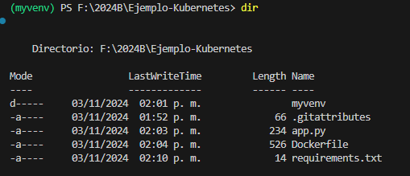
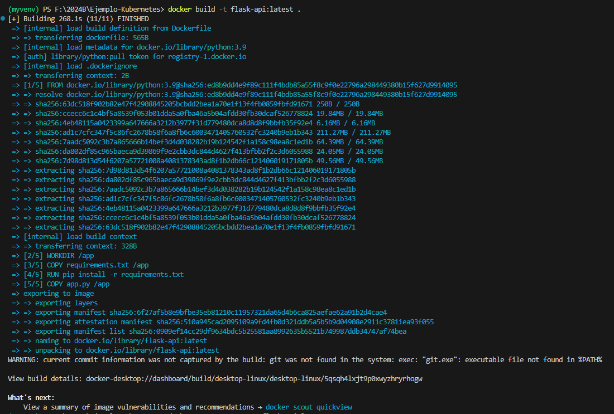
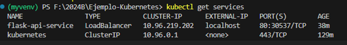
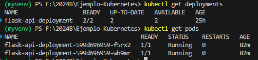
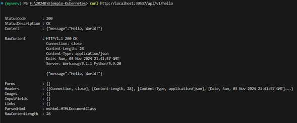
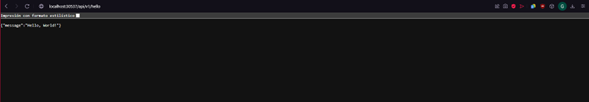
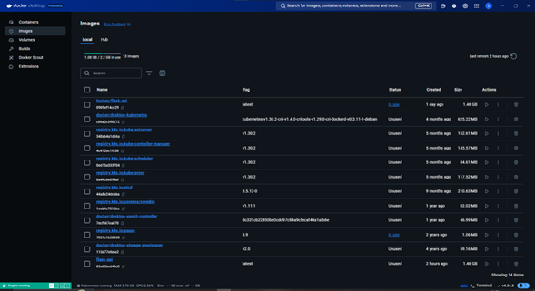
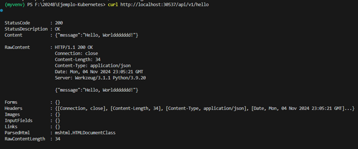
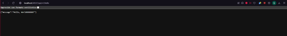
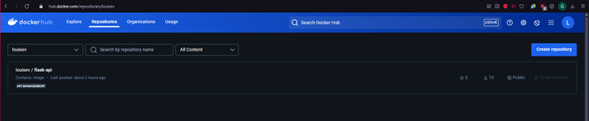

# Ejemplo Kubernetes
 API creada con Flask usando Docker y después importándola en un clúster de Kubernetes.

## Introducción
Veremos entonces en este reporte, cómo hacer un ejemplo sencillo en el cual
crearemos una API con Flask usando Docker y después importándola en un clúster
de Kubernetes.
Estaré usando Python para crear la aplicación la cual mostrara solamente la cadena
de texto “Hello World” y mostrare algunas modificaciones y como hacer los cambios
para que surtan efecto. También usaré Visual Studio y Docker Desktop.

## Docker Desktop
Primero una ves teniendo Docker Desktop, el programa cuenta con una opción para
activar Kubernetes en esta misma para poder utilizar sus comandos.


En ajustes podemos encontrar la opción de activar Kubernetes y así un clúster,
después aplicamos y reiniciamos.
Ahora instalamos la biblioteca de Flask en Python la cual nos permitira crear la
aplicación.

## Creación de API
### Nota: Es recomendable utilizar un entorno virtual en Python

Una vez teniendo un entorno virtual podemos ejecutar el siguiente comando para instalar las dependencias de Flask:
```bash
pip install Flask
```

Ya instalado, para aplicar los cambios, reiniciamos Visual Studio cerrándolo y volviéndolo a abrir.
Entonces ahora si comenzaremos a crear la aplicación:
```python
from flask import Flask, jsonify

app = Flask(__name__)

@app.route('/api/v1/hello', methods=['GET'])
def hello():
    return jsonify(message="Hello, World!")

if __name__ == "__main__":
    app.run(host='0.0.0.0', port=5000)

```

Esta API tiene un solo endpoint, /api/v1/hello, que devuelve un mensaje JSON de saludo.  
  
  Está colocando en el puerto 5000 y el host como 0.0.0.0 ya que significa que la aplicación está escuchando en todas las interfaces de red del contenedor, lo que permite que Kubernetes pueda redirigir tráfico desde el puerto del nodo a este puerto del contenedor.
A este script de Python lo llamamos app.py  

  ## Crear Dockerfile
  Ahora debemos crear un Dockerfile, para empaquetar la API en una imagen de Docker. En Visual Studio solamente creamos un nuevo archivo y de nombre Dockerfile y listo. Dentro de este archivo agregamos los siguientes ajustes:
```Dockerfile
# Usa una imagen base de Python con la versión 3.9
FROM python:3.9

# Establece el directorio de trabajo en el contenedor
WORKDIR /app

# Copia el archivo de requerimientos (para instalar dependencias)
COPY requirements.txt /app

# Instala las dependencias usando pip
RUN pip install -r requirements.txt

# Copia el código fuente al contenedor
COPY app.py /app

# Expone el puerto 5000 (puerto en el que Flask ejecutará la API)
EXPOSE 5000

# Comando para correr la aplicación
CMD ["python", "app.py"]
```

Este Dockerfile realiza los siguientes pasos:  
1. Usa una imagen base de Python.
2.	Establece un directorio de trabajo (/app).
3.	Copia e instala los paquetes necesarios.
4.	Copia el archivo app.py.
5.	Expone el puerto 5000 para que la API sea accesible.
6.	Ejecuta la aplicación Flask.

## Crear requirements
Y ahora debemos crear un archivo de texto con el nombre requirements.txt para instalar Flask.
```txt
Flask==3.0.3
```

Y esto es lo único que contendrá.

Comprobaremos los archivos que hay en nuestra carpeta, todo debe estar en la misma. Podemos ejecutar el comando dir para ver que elementos contiene la carpeta actual.



Debemos tener los 3 archivos: app.py, Dockerfile y requirements.txt

## Construir la imagen Docker
Construiremos ahora la imagen Docker y la probaremos, debemos ejecutar el siguiente comando:
```bash
docker build -t flask-api:latest .
```

Despues de algunos minutos veremos que se creó correctamente:



Para este caso, tuve que crear una cuenta en el sitio web de Docker Hub la cual nos permite subir la imagen de Docker que vamos a crear. Ya que tengamos abierta la sesión en un navegador, en la terminal ejecutamos el comando:
```bash
docker login
```

Creamos el tag del repositorio el cual debe ser el mismo nombre cuando estemos por crear la imagen Docker:
```bash
docker tag flask-api:latest <tu-usuario-de-docker-hub>/flask-api:latest
```

Y ahora subimos la imagen a Docker Hub con el siguiente comando:
```bash
docker push <tu-usuario-de-docker-hub>/flask-api:latest
```

## Configuración de Kubernetes
Lo siguiente es crear los archivos de configuración de Kubernetes, los cuales deben estar en la misma carpeta donde esta el código API, a estos archivos los llamaremos api-deployment.yaml y api-service.yaml estos archivos le dirán a Kubernetes cómo desplegar el API.  
1. api-deployment.yaml

Este archivo define un Deployment, que controla el ciclo de vida de los contenedores de la API, así como el número de réplicas que deseas ejecutar.
  
  Crea un archivo llamado api-deployment.yaml con el siguiente contenido:
  ```yaml
apiVersion: apps/v1
kind: Deployment
metadata:
  name: flask-api-deployment
spec:
  replicas: 2
  selector:
    matchLabels:
      app: flask-api
  template:
    metadata:
      labels:
        app: flask-api
    spec:
      containers:
      - name: flask-api
        image: louisev/flask-api:v2
        ports:
        - containerPort: 5000

```

2. api-service.yaml

  Este archivo define un Service, que expone el Deployment y permite el acceso desde fuera del clúster (utilizando el tipo LoadBalancer).
  
  Crea un archivo llamado api-service.yaml con el siguiente contenido:
  ```yaml
apiVersion: v1
kind: Service
metadata:
  name: flask-api-service
spec:
  selector:
    app: flask-api
  ports:
    - protocol: TCP
      port: 80
      targetPort: 5000
  type: LoadBalancer

```

### Nota: antes de continuar debemos saber el Port por el cual esta escuhando la imagen Docker, primero debemos ejecutar el siguiente comando para que la imagen comienze a transmitir por el puerto que asignamos en la aplicación.
```bash
docker run -p 5000:5000 flask-api:latest
```

Ejecutamos el siguiente comando para saber el puerto:
```bash
kubectl get services
```

Lo cual nos dará los puertos:



Aquí nos interesa el puerto del servicio con el nombre que le pusimos a nuestra imagen Docker, en este caso es el puerto 80:30537.  
Regresando al archivo api-service.yaml, editamos el contenido cambiando el tipo de cluster de LoadBalancer a NodePort y colocando el numero de puerto que nos arrojo el comando ingresado anteriormente:
```yaml
apiVersion: v1
kind: Service
metadata:
  name: flask-api-service
spec:
  selector:
    app: flask-api
  ports:
    - protocol: TCP
      port: 80
      targetPort: 5000
      nodePort: 30537
  type: NodePort

```

En la terminal, asegúrate de estar en el mismo directorio que contiene api-deployment.yaml y api-service.yaml. Luego, ejecuta los siguientes comandos para aplicar los archivos de configuración en Kubernetes:
```bash
kubectl apply -f api-deployment.yaml
```

```bash
kubectl apply -f api-service.yaml
```

Estos comandos crearán tanto el Deployment como el Service en Kubernetes.  
Para asegurarte de que el Deployment y el Service se hayan creado correctamente, puedes usar los siguientes comandos:
```bash
kubectl get deployments
```

```bash
kubectl get pods
```

Esto nos da la información de los archivos deployment y service y nos indica si estos están funcionando correctamente, si vemos los pods con el estatus Running entonces están funcionando como deben.



## Pruebas
Solo nos queda verificar si la API y los servicios están funcionando, podemos ejecutar el siguiente comando:
```bash
curl http://localhost:30537/api/v1/hello
```

O usando el navegador ingresamos el siguiente enlace:
```bash
http://localhost:30537/api/v1/hello
```

En la terminal podemos ver esto: 



O en el navegador esto:



En Docker Desktop podemos detener los contenedores siempre que queramos así como monitorear su estado:



Y así podemos tener una API sencilla utilizando Docker y Kubernetes.

## Modificar API
En el caso de que queramos modificar el código un poco, debemos hacerlo en el código fuente de la app, crear una etiqueta diferente para la imagen y volverla a subir. Para esto hacemos lo siguiente:
```python
from flask import Flask, jsonify

app = Flask(__name__)

@app.route('/api/v1/hello', methods=['GET'])
def hello():
    return jsonify(message="Hello, Worlddddddd!")

if __name__ == "__main__":
    app.run(host='0.0.0.0', port=5000)

```

Aquí solamente modifiqué el mensaje que muestra el JSON. Guardamos el archivo.  
Asigna una nueva etiqueta con un número de versión cada vez que actualices la imagen (por ejemplo, flask-api:v2 en lugar de latest). Esto asegura que Kubernetes descargue la nueva imagen.
```bash
docker build -t flask-api:v2
```

Luego, para Docker Hub:
```bash
docker tag flask-api:v2 <tu-usuario-de-docker-hub>/flask-api:v2
```

```bash
docker push <tu-usuario-de-docker-hub>/flask-api:v2
```

Actualizamos api-deployment.yaml para que apunte a esta nueva etiqueta:
```yaml
containers:
      - name: flask-api
        image: louisev/flask-api:v2
        ports:
        - containerPort: 5000

```

Aplicamos el despliegue con el archivo actualizado:
```bash
kubectl apply -f api-deployment.yaml
```

Y ya deberíamos poder ver la modificación en el navegador o en la terminal:



O en el navegador:



En el sitio web de Docker Hub podemos ver el repositorio que hemos creado:



