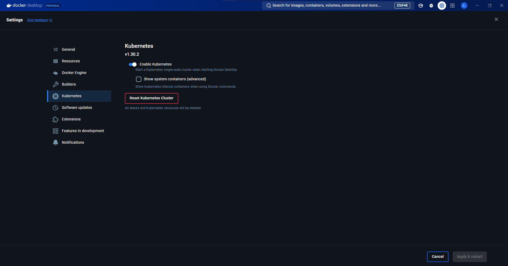

# Ejemplo Kubernetes
 API creada con Flask usando Docker y después importándola en un clúster de Kubernetes.

## Introducción
Veremos entonces en este reporte, cómo hacer un ejemplo sencillo en el cual
crearemos una API con Flask usando Docker y después importándola en un clúster
de Kubernetes.
Estaré usando Python para crear la aplicación la cual mostrara solamente la cadena
de texto “Hello World” y mostrare algunas modificaciones y como hacer los cambios
para que surtan efecto. También usaré Visual Studio y Docker Desktop.

## Docker Desktop
Primero una ves teniendo Docker Desktop, el programa cuenta con una opción para
activar Kubernetes en esta misma para poder utilizar sus comandos.

